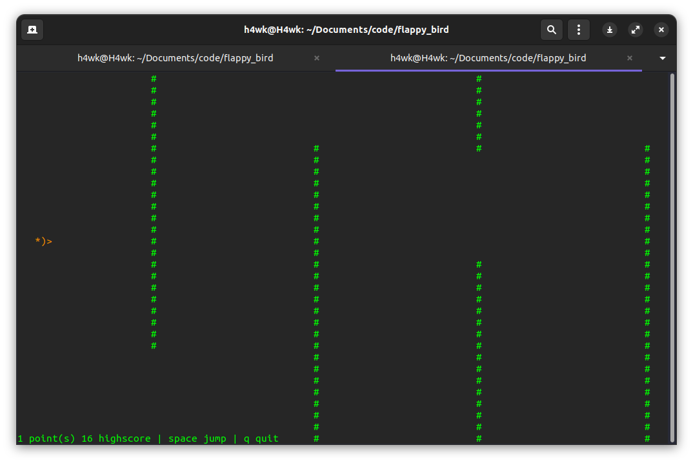

# Terminal Flappy Bird
A terminal based Flappy Bird game. Built with ncurses library.

## Play
1. Clone the repository
```shell
git clone https://www.github.com/H4wk507/terminal-flappy-bird
```
2. Compile it
```shell
make
```
3. Run it
```shell
./flappy
```
## License
Licensed under MIT.
